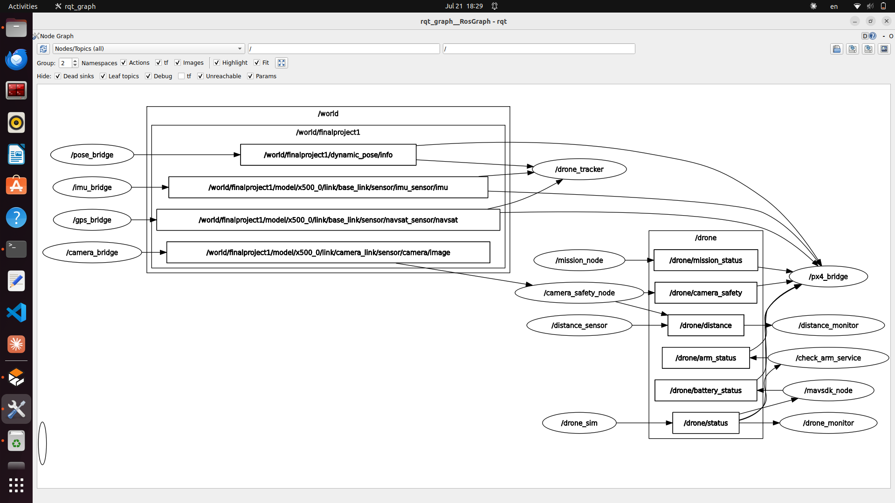

[README.md](https://github.com/user-attachments/files/30476753/README.md)
# 🚁 Hospital Drone System — KFSHRC Flight Operations

> **Autonomous Medical Delivery Drone** using ROS2 Humble + PX4 SITL + Gazebo Harmonic  
> King Faisal Specialist Hospital & Research Centre (KFSHRC) — Riyadh, Saudi Arabia 🇸🇦

---

## 📋 Project Overview

This project implements a fully autonomous hospital drone system for medical delivery between two helipads (HELIPAD1 → HELIPAD2). The system integrates **ROS2 Humble**, **PX4 SITL**, **Gazebo Harmonic**, and **MAVSDK** to provide real-time flight control, sensor monitoring, and safety features.

---

## 🏗️ System Architecture

```
Gazebo Simulation (PX4 SITL)
         │
         ▼
┌─────────────────────────────────────────┐
│           ros_gz_bridge Layer            │
│  pose_bridge │ imu_bridge │ gps_bridge  │
│              camera_bridge               │
└─────────────────────┬───────────────────┘
                      │
                      ▼
┌─────────────────────────────────────────┐
│         ROS2 Nodes (/drone namespace)    │
│                                          │
│  mission_node    →  /drone/mission_status│
│  camera_safety   →  /drone/camera_safety │
│  distance_sensor →  /drone/distance      │
│  check_arm       →  /drone/arm_status    │
│  mavsdk_node     →  /drone/battery_status│
│  drone_sim       →  /drone/status        │
│                                          │
│              ↓ all data                  │
│           px4_bridge                     │
└─────────────────────────────────────────┘
         │
         ▼
    PX4 Flight Controller
```

---

## 📁 Project Structure

```
hospital_drone_ws/
├── hospital_drone_interfaces/     # Custom ROS2 Interfaces
│   ├── action/
│   │   └── DroneAction.action     # Goal/Feedback/Result for mission
│   ├── msg/
│   │   └── DroneStatus.msg        # Custom drone status message
│   └── srv/
│       └── CheckArm.srv           # Arm check service definition
│
└── hospital_drone_pkg/            # Main Package
    ├── hospital_drone_pkg/        # Python nodes
    │   ├── camera_safety_node.py  # Camera-based obstacle detection
    │   ├── check_arm_service.py   # Pre-flight arm verification
    │   ├── distance_monitor.py    # Distance subscriber
    │   ├── distance_sensor.py     # Distance publisher
    │   ├── drone_monitor.py       # System status monitor
    │   ├── drone_sim.py           # Mission status publisher
    │   ├── drone_tracker.py       # Real-time position tracking
    │   ├── mavsdk_node.py         # MAVSDK ↔ ROS2 bridge
    │   ├── mission_node.py        # Autonomous mission executor
    │   └── px4_bridge.py          # PX4 data aggregator
    │
    └── launch/
        ├── hospital_drone_launch.py    # Main ROS2 nodes
        └── tracking_bridge_launch.py   # Gazebo bridges + tracker
```

---

## 🔧 ROS2 Node Graph



### Gazebo Bridge Layer (`/world` namespace)
| Bridge | Gazebo Topic | ROS2 Message |
|--------|-------------|--------------|
| `pose_bridge` | `/world/finalproject1/dynamic_pose/info` | `tf2_msgs/TFMessage` |
| `imu_bridge` | `/world/.../imu_sensor/imu` | `sensor_msgs/Imu` |
| `gps_bridge` | `/world/.../navsat_sensor/navsat` | `sensor_msgs/NavSatFix` |
| `camera_bridge` | `/world/.../camera_link/sensor/camera/image` | `sensor_msgs/Image` |

### ROS2 Nodes (`/drone` namespace)
| Node | Topic Published | Subscribers |
|------|----------------|-------------|
| `drone_sim` | `/drone/status` | drone_monitor, mavsdk_node, check_arm_service, px4_bridge |
| `mission_node` | `/drone/mission_status` | drone_monitor, px4_bridge |
| `camera_safety_node` | `/drone/camera_safety` | px4_bridge |
| `distance_sensor` | `/drone/distance` | distance_monitor, drone_monitor |
| `check_arm_service` | `/drone/arm_status` | px4_bridge |
| `mavsdk_node` | `/drone/battery_status` | px4_bridge |
| `drone_tracker` | `/drone/tracking` | dashboard |

---

## 🚀 Installation & Setup

### Prerequisites
```bash
# ROS2 Humble
sudo apt install ros-humble-desktop

# MAVSDK
pip install mavsdk

# ROS GZ Bridge
sudo apt install ros-humble-ros-gz

# PX4 Autopilot
git clone https://github.com/PX4/PX4-Autopilot.git --recursive
cd PX4-Autopilot
bash ./Tools/setup/ubuntu.sh
```

### Build
```bash
cd ~/hospital_drone_ws
colcon build
source install/setup.bash
```

---

## ▶️ Running the System

### Step 1 — Launch PX4 + Gazebo
```bash
cd ~/PX4-Autopilot
PX4_GZ_MODEL_POSE="-9.97,-0.46,0.55,0,0,0" \
PX4_GZ_WORLD=finalproject1 \
make px4_sitl gz_x500
```

### Step 2 — Launch ROS2 Nodes
```bash
cd ~/hospital_drone_ws
source install/setup.bash
ros2 launch hospital_drone_pkg hospital_drone_launch.py
```

### Step 3 — Launch Bridge + Tracker
```bash
ros2 launch hospital_drone_pkg tracking_bridge_launch.py
```

### Step 4 — Start Mission (HELIPAD1 → HELIPAD2)
```bash
ros2 service call /start_mission std_srvs/srv/Trigger {}
```

### Step 5 — Arm Drone via ROS2
```bash
ros2 service call /mavsdk_arm std_srvs/srv/Trigger {}
```

---

## 📊 Terminal Output Example

### Hospital Launch Output
```
[drone_sim-3]          Published: Drone delivering medication - step: 4369
[check_arm_service-1]  Received drone status: Drone delivering medication - step: 4369
[mavsdk_node-8]        Received: Drone delivering medication - step: 4369
[drone_monitor-4]      Received: Drone delivering medication - step: 4369
[distance_sensor-5]    Published: Distance: 10.5m - Safe
[distance_monitor-6]   I heard: "Distance: 10.5m - Safe"
```

### Tracking Launch Output
```
[drone_tracker-6]  Drone Position → X:6.18 Y:1.46 Z:0.05
[drone_tracker-6]  GPS Received  → Lat: 47.39798, Lon: 8.54625
[drone_tracker-6]  IMU Received  → Angular Vel Z: 0.00
```

### Mission Output
```
requester: making request: std_srvs.srv.Trigger_Request()
response:
std_srvs.srv.Trigger_Response(success=True, message='Mission Started!')

[mission_node]  GPS Ready! ✅
[mission_node]  Uploading mission...
[mission_node]  Armed ✅
[mission_node]  Starting mission...
[mission_node]  Waypoint 1/4
[mission_node]  Waypoint 2/4
[mission_node]  Waypoint 3/4
[mission_node]  Mission Complete! ✅
[mission_node]  Landed on helipad2! 🛬
```

---

## ✅ Features

- ✅ Autonomous waypoint mission (HELIPAD1 → HELIPAD2)
- ✅ Real-time GPS, IMU, and Pose tracking from Gazebo
- ✅ Camera-based safety monitoring (`camera_safety_node`)
- ✅ Distance sensor for building avoidance
- ✅ Service-based arm verification before flight
- ✅ Full ROS2 ↔ PX4 integration via MAVSDK
- ✅ Custom ROS2 interfaces (msg, srv, action)
- ✅ Live dashboard via rosbridge WebSocket
- ✅ Namespace-organized `/drone` topic structure

---

## 🌐 Dashboard

Live flight operations dashboard available at:
https://github.com/hkhi18/Hospital-logestic-Drone/blob/main/Dashboard.jpg``
file:///home/hanin/hospital_drone_ws/dashboard/index.html
```

Connect via rosbridge:
```bash
ros2 launch rosbridge_server rosbridge_websocket_launch.xml
```
WebSocket: `ws://localhost:9090`

---

## Author

**Hanin** —This project was developed as part of the Tuwaiq Academy robotics & drone engineering program. volunteer Data Science at King Faisal Specialist Hospital & Research Centre (KFSHRC)  


---

## 📚 References

- [ROS2 Humble Documentation](https://docs.ros.org/en/humble/)
- [PX4 Autopilot](https://docs.px4.io)
- [MAVSDK Python](https://mavsdk.mavlink.io)
- [Gazebo Harmonic](https://gazebosim.org/docs)
- [QGroundControl](https://docs.qgroundcontrol.com)
